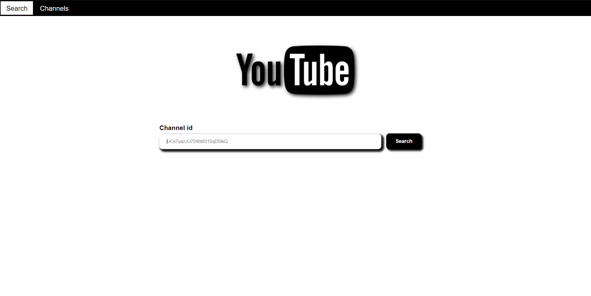
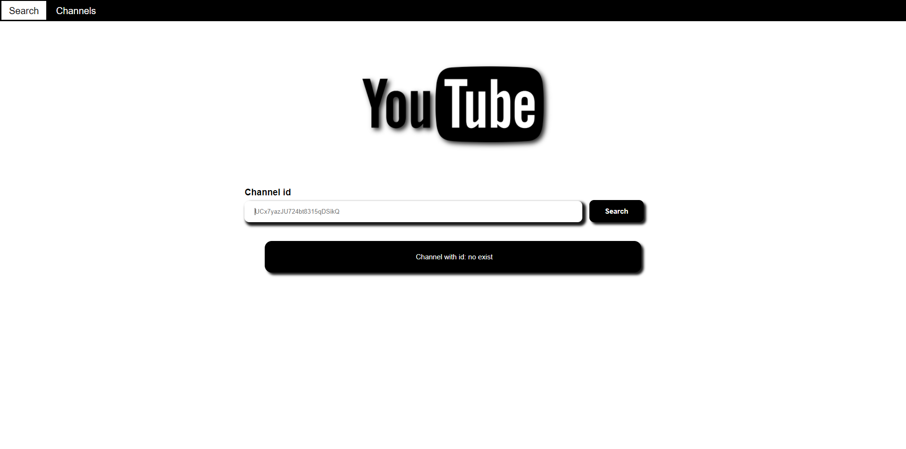
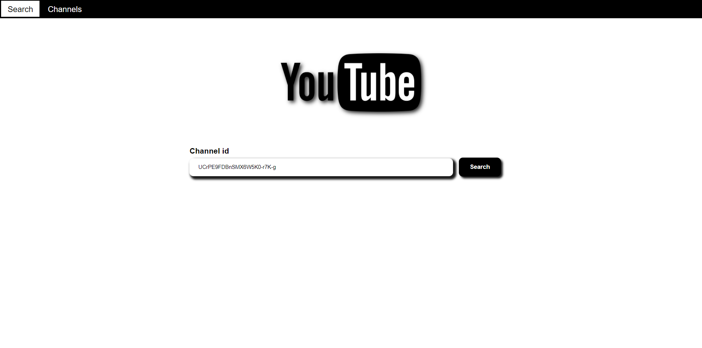
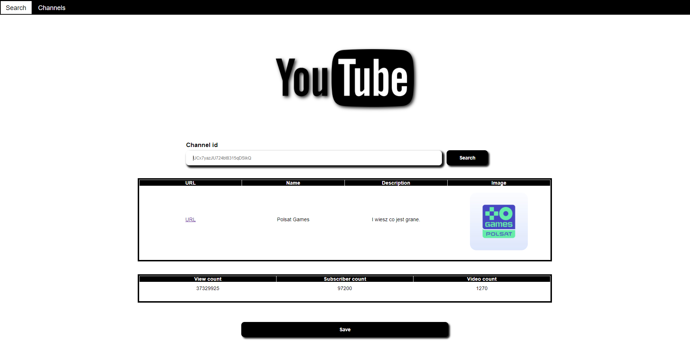
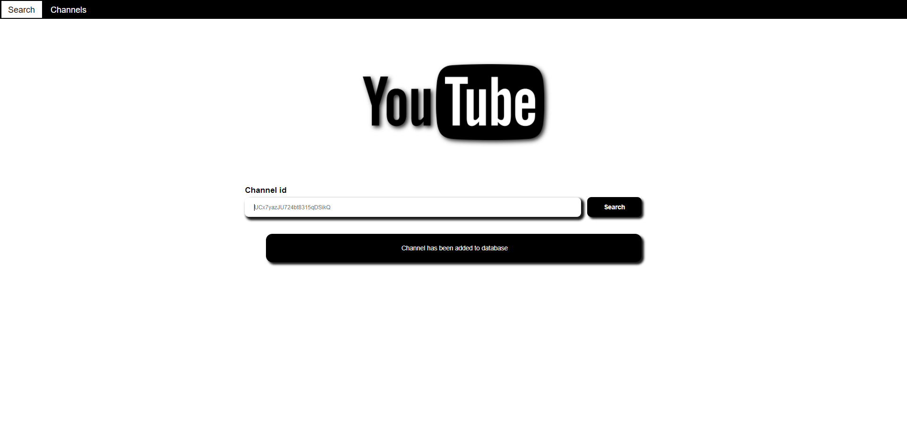
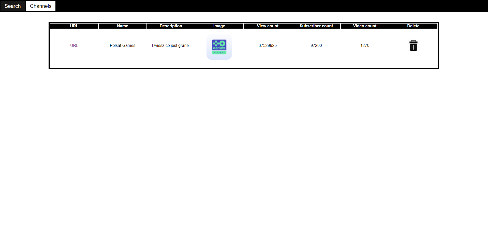
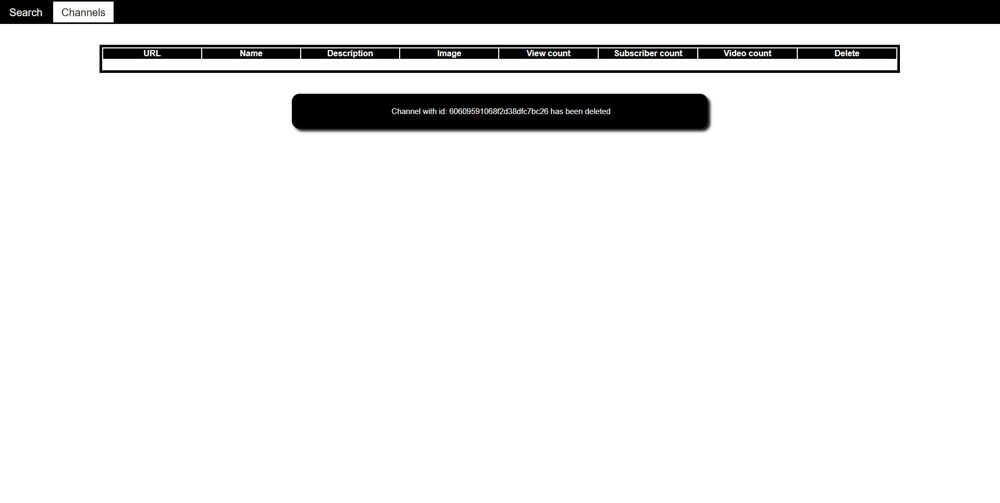

# youtube_api_mongo_db
## Project with using YouTube API and MongoDB
### User enter channel id and click button "Search". Then page show information about channel and his statistics. Additionally user can save channel into database (MongoDB).

**Start page**

**If channel with id not exist then page show message**

**Searching channel with id: UCrPE9FDBnSMX6W5K0-r7K-g**

**Result searching - information about channel and statistics**

**Save channel in database**

**Channels in database**

**Delete channel from database**

